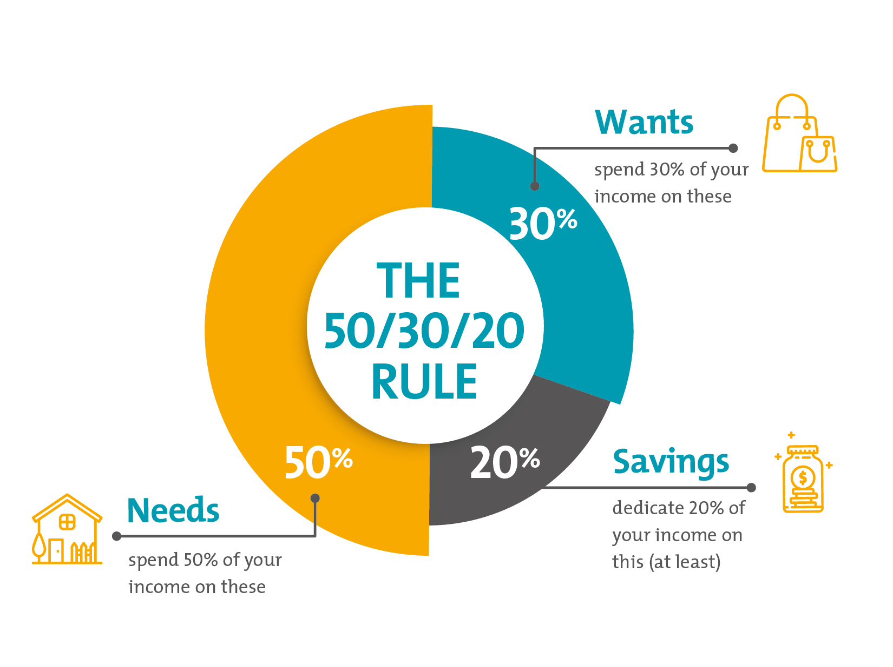

# Budgeting

Budgeting is the process of creating a plan to manage your income and expenses. 

### Why Budget?
- Achieve financial goals
- Build an emergency fund
- Avoid debt

### Popular Budgeting Methods
1. **50/30/20 Rule**:
   - Allocate 50% of income to needs, 30% to wants, and 20% to savings.
2. **Zero-Based Budgeting**:
   - Assign every dollar of income a purpose, leaving no unallocated funds.
3. **Envelope System**:
   - Set aside cash in labeled envelopes for specific spending categories (e.g., groceries, utilities).
   
   - [Home](./README.md)