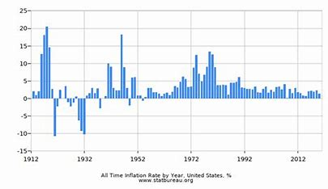

# Economics

Economics is the study of how people allocate resources, and it has a direct impact on investments and budgeting.

### Key Economic Concepts
- **Supply and Demand**: The relationship between product availability and consumer demand affects prices. When demand is high and supply is low, prices rise.
- **Inflation**: The rate at which the general price level of goods and services rises over time, reducing purchasing power.
- **Interest Rates**: The cost of borrowing money, set by central banks. Lower interest rates encourage borrowing and spending; higher rates encourage saving.

- [Home](./README.md)